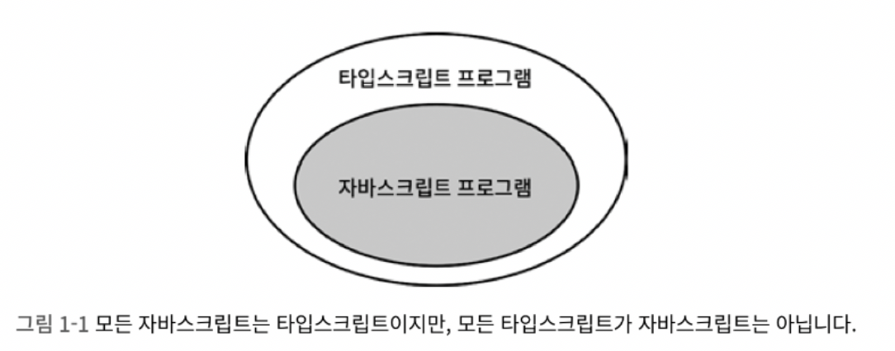
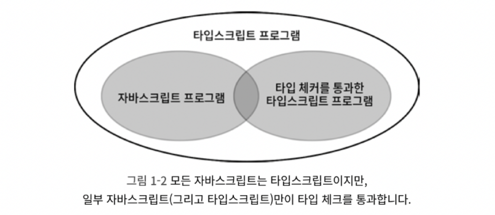

# 타입스크립트와 자바스크립트의 관계 이해하기

## 타입스크립트는 자바스크립트의 상위 집합이다.



- 명제 : 모든 자바스크립트 프로그램이 타입스크립트이다. (참)
- 역 : 모든 타입스크립트 프로그램은 자바스크립트이다. (거짓)
  - 타입스크립트는 별도의 문법을 가지고 있기 때문에 일반적으로 유효한 자바스크립트 프로그램이 아니다.

## 타입 시스템의 목표 중 하나는 ‘런타임에 오류를 발생시킬 코드를 미리 찾아내는 것’이다.

타입스크립트는 자바스크립트 런타임 동작을 모델링하는 타입 시스템을 가지고 있기 때문에 런타임 오류를 발생시키는 코드를 찾아내려고 한다. 그러나 모든 오류를 찾아내리라 기대하면 안된다. 타입 체커를 통과하면서도 런타임 오류를 발생시키는 코드는 충분히 존재할 수 있기 때문이다.

In JavaScript

```jsx
const states = [
  { name: "Alabama", capital: "Montgomery" },
  { name: "Alaska", capital: "Juneau" },
  { name: "Arizona", capital: "Phoenix" },
];
for (const state of states) {
  console.log(state.capitol);
}

/*
실행 결과
undefined
undefined
undefined
*/
```

자바스크립트는 오류를 발생시키지 않는다.

In TypeScript

```jsx
const states1 = [
  { name: "Alabama", capitol: "Montgomery" },
  { name: "Alaska", capitol: "Juneau" },
  { name: "Arizona", capitol: "Phoenix" },
];

for (const state of states1) {
  console.log(state.capital);
}
```

> error TS2551: Property 'capital' does not exist on type '{ name: string; capitol: string; }'.
> Did you mean 'capitol'?

타입스크립트의 타입 체커는 추가적인 타입 구문 없이도 오류를 찾아낸다. 하지만, 어느 쪽이 의도한 코드인지 분간해낼수는 없다. 위의 예시에서 `console.log(state.capital)`이 아닌 `states1 객체 내의 capitol`이 의도한 코드가 아닌 게 분명하다.

따라서, 명시적으로 states를 선언하여 의도를 분명하게 하는 것이 좋다.

In TypeScript

```jsx
interface State {
  name: string;
  capital: string;
}

const states2: State[] = [
  { name: "Alabama", capitol: "Montgomery" },
  { name: "Alaska", capitol: "Juneau" },
  { name: "Arizona", capitol: "Phoenix" },
];

for (const state of states2) {
  console.log(state.capital);
}
```

> error TS2322: Type '{ name: string; capitol: string; }' is not assignable to type 'State'.
> Object literal may only specify known properties, but 'capitol' does not exist in type 'State'. Did you mean to write 'capital'?



## 타입스크립트 타입 시스템은 자바스크립트의 런타임 동작을 ‘모델링’합니다.

In JavaScript

```jsx
const x = 2 + "3";
const y = "2" + 3;

console.log(x); // 23
console.log(y); // 23
```

In TypeScript

```jsx
const x = 2 + "3";
const y = "2" + 3;

console.log(x); // 23
console.log(y); // 23
```

다른 언어였다면 런타임 오류가 될 만한 코드이다. 하지만 타입스크립트의 타입 체커는 정상으로 인식한다.
