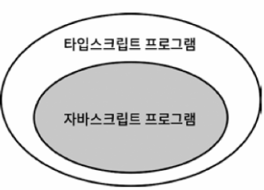
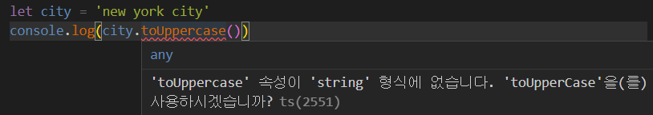
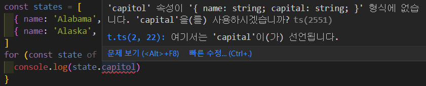

타입스크립트란 무엇인가, 타입스크립트를 어떻게 여겨야 하는가, 자바스크립트와는 어떤 관계인가, 타입스크립트의 타입들은 null이 가능한가, any타입에서는 어떤가, 덕 타이핑(duck typing)이 가능한가 등을 알아본다.

<br/>

## Item1) 타입스크립트와 자바스크립트의 관계 이해하기

타입스크립트는 자바스크립트의 상위집합(superset)이다.

`.js` 파일에 있는 코드는 이미 타입스크립트라고 할 수 있다. `main.js` 파일명을 `main.ts`로 바꿔도 달라지는 것은 없다.

모든 자바스크립트 프로그램이 타입스크립트라는 명제는 참이지만, 그 반대는 성립하지 않는다. 타입스크립트 프로그램이지만 자바스크립트가 아닌 프로그램이 존재한다. 이는 타입스크립트가 타입을 명시하는 추가적인 문법을 가지기 때문이다.



```tsx
function greet(who: string) {
	console.log('Hello', who)
}
```

: string은 타입스크립트에서 쓰이는 타입 구문이다. 타입 구문을 사용하는 순간부터 자바스크립트는 타입스크립트 영역으로 들어간다.

<br/>

타입 시스템의 목표 중 하나는 런타임에 오류를 발생시킬 코드를 미리 찾아내느 것이다. 타입스크립트가 정적 타입 시스템이기 때문이다.





타입스크립트 타입 체커는 추가적인 타입 구문 없이도 오류를 찾아낸다. 하지만 capital과 capitol 중 어느쪽이 오타인지 판단하지 못한다. 따라서 명시적으로 states를 선언하여 의도를 분명히 하는게 좋다.

```tsx
interface State {
  name: string;
  capital: string;
}
```