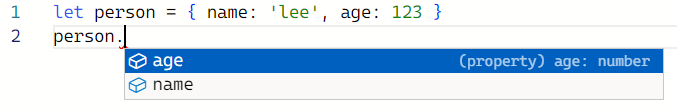
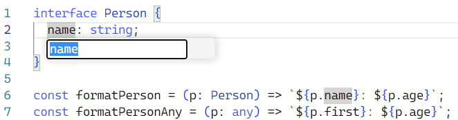
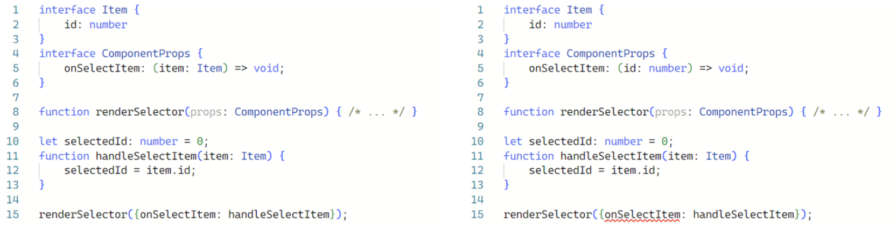

# Item5) any 타입 지양하기

타입스크립트의 타입 시스템은 점진적이고 선택적이다. 코드에 타입을 조금씩 추가할 수 있기 때문에 점진적이며, 언제든 타입 체커를 해제할 수 있기 때문에 선택적이다. 이 기능들의 핵심은 any이다.

```tsx
let age: number;
age = "12";
// ~~~ 'string' 형식은 'number' 형식에 할당할 수 없습니다.
age = "12" as any; // OK
```

특별한 경우를 제외하고는 any를 사용하면 타입스크립트의 장점을 누릴 수 없다. 부득이하게 any를 사용해도 그 위험성을 알고있어야 한다.

<br>

### **타입 안전성이 없다.**

위에서 age는 number이다. 하지만 as any를 사용하면 string타입을 할당할 수 있다. 타입 체커는 선언에 따라 number타입으로 판단할 것이고 혼란이 인다.

```tsx
age += 1; // 런타임에서 정상이고, age는 "121"
```

<br>

### **함수 시그니처를 무시한다.**

호출할 때 약속된 타입의 입력을 제공하고, 함수는 약속된 타입의 출력을 반환한다. 그러나 any 타입을 사용하면 이 약속을 어길 수 있다.

```tsx
function calculateAge(birthDate: Date): number {
   return 0;
}

let birthDate**: any** = '1990-01-19';
calculateAge(birthDate);  // 정상
```

birthData는 string이 아닌 Date 타입이어야 한다. any 타입을 사용하면 calculateAge의 약속을 무시한다.

JS는 종종 암시적으로 타입을 변환해서 이런 경우 특히 문제가 될 수 있다. string타입은 number타입이 필요한 곳에서 오류 없이 실행될 때가 있고, 그럴 경우 다른 곳에서 문제를 일으킨다.

<br>

### **언어 서비스가 적용되지 않는다.**

타입스크립트 언어 서비스는 자동완성 기능과 적절한 도움말을 제공한다. 그러나 any타입인 심벌을 사용하면 아무런 도움을 받지 못한다.



이름 변경 기능(F2)에서도 any는 바뀌지 않는다.



<br>

### **코드 리팩토링 때 버그를 감춘다.**

어떤 아이템을 선택할 수 있는 웹 애플리케이션을 만든다면 애플리케이션에 onSelectItem 콜백이 있는 컴포넌트가 있다. 선택하려는 아이템의 타입을 any라고 한다. onSelectItem 콜백이 있는 컴포넌트를 사용하는 코드도 있다.

```tsx
interface ComponentProps {
  onSelectItem: (item: any) => void;
}

function renderSelector(props: ComponentProps) {
  /* ... */
}

let selectedId: number = 0;
function handleSelectItem(item: any) {
  selectedId = item.id;
}

renderSelector({ onSelectItem: handleSelectItem });
```

onSelectItem에 필요한 부분(id)만 전달하도록 컴포넌트를 개선한다.

```tsx
interface ComponentProps {
  onSelectItem: (id: number) => void;
}
```

x타입 체크를 통과한다. handleSelectItem은 any 매개변수를 받는다. 따라서 id를 받아도 문제없다고 나온다. id를 전달받으면 타입 체커를 통과해도 런타임에는 오류가 발생한다. (id.id는 없으니까) any타입이 아니라 구체적 타입을 사용했으면 타입체커가 오류를 발견했을 것이다.



<br>

### **타입 설계를 감춰버린다.**

any타입을 사용하면 타입 설계가 불분명해진다. 설계가 잘 되었는지, 설계가 어떻게 되었는지 전혀 알 수 없다.

<br>

### **타입시스템의 신뢰도를 떨어뜨린다.**

보통 타입 체커가 실수를 잡아주고 코드의 신뢰도가 높아진다. 그러나 런타임에 타입 오류를 발견하면 타입 체커를 신뢰할 수 없을것이다. any타입을 쓰지 않으면 런타임에 발견될 오류를 미리 잡을 수 있고 신뢰도를 높일 수 있다.

<br>

## **⇒ 최대한 any타입 사용을 피하자.**
